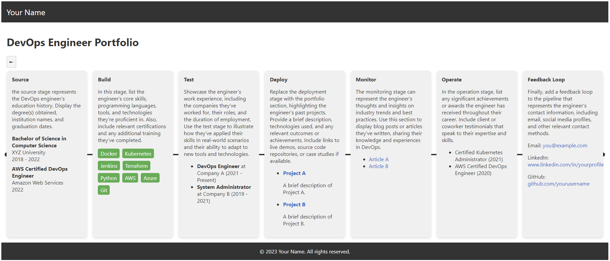

# DevOps Portfolio

A CI/CD pipeline inspired personal website and portfolio for DevOps engineers. This project showcases the professional skills and experience of a DevOps engineer using a CI/CD pipeline-like design.



## Table of Contents

- [DevOps Portfolio](#devops-portfolio)
  - [Table of Contents](#table-of-contents)
  - [Features](#features)
  - [Technologies Used](#technologies-used)
  - [Getting Started](#getting-started)
    - [Prerequisites](#prerequisites)
    - [Installation](#installation)
    - [Customization](#customization)
    - [Contributing](#contributing)
    - [License](#license)
    - [Contact](#contact)

## Features

- CI/CD pipeline-inspired design
- Play button to trigger pipeline animation
- Each stage displays relevant professional information
- Built with Svelte for a modern, reactive web experience

## Technologies Used

- [Svelte](https://svelte.dev/)
- HTML5
- CSS3

## Getting Started

### Prerequisites

- [Node.js](https://nodejs.org/) (>= 12.x.x)
- [npm](https://www.npmjs.com/) (>= 6.x.x) or [yarn](https://yarnpkg.com/)

### Installation

1. Clone the repository

```sh
git clone https://github.com/jrdnrgrs/devops-site.git
```

2. Change to the project directory
```sh
cd devops-site
```
3. Install dependencies
```sh
npm install
```
4. Start the development server
```sh
npm run dev
```
5. Open your browser and navigate to `http://localhost:5000` to view the website

### Customization

- Update the `src/Pipeline.svelte` file to add or modify stages and their content
- Replace the `src/components` files with your own content for each stage
- Customize the appearance and animations by modifying the CSS in `src/Pipeline.svelte`

### Contributing

Contributions, issues, and feature requests are welcome! Feel free to check <a href="https://github.com/jrdnrgrs/devops-site/issues" target="_new">issues</a> and submit a <a href="https://github.com/jrdnrgrs/devops-site/pulls" target="_new">pull request</a>.

### License

This project is <a href="https://choosealicense.com/licenses/mit/" target="_new">MIT</a> licensed.

### Contact

Your Name - <a href="mailto:jrdnrgrs@gmail.com" target="_new">jrdnrgrs@gmail.com</a>
Project Link: <a href="https://github.com/jrdnrgrs/devops-site" target="_new">https://github.com/jrdnrgrs/devops-site</a>